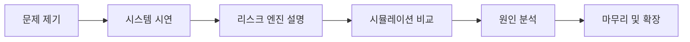

# 🎤 발표 가이드

!!! note "한 줄 요약"
    인천항 반입 cut-off 리스크를 예측하여 배차 의사결정을 지원하는 웹 서비스

이 문서는 6분 발표, 라이브 데모, Q&A 대응까지 한 번에 준비할 수 있도록 구성한 발표용 운영 가이드입니다. 핵심 메시지는 **"혼잡 가시화에서 배차 의사결정까지"** 입니다.

## 발표 흐름 한눈에 보기

## 6분 발표 스크립트

### 1분: 문제 제기 — 분산된 데이터를 수동 조합하는 현실

"현장의 배차 담당자는 교통 상황, 터미널 혼잡, 반입량, cut-off 시간을 각각 따로 확인한 뒤 머릿속으로 종합 판단해야 합니다. 문제는 데이터가 있어도 **이 작업을 지금 출발시켜도 되는지** 바로 답하기 어렵다는 점입니다. 결국 운영 경험에 의존하게 되고, cut-off 미준수 리스크가 발생합니다. 저희는 이 간극을 줄이기 위해, 분산된 데이터를 하나의 리스크 신호로 통합하는 MVP를 만들었습니다."

### 1분: 시스템 시연 — 입력 → 결과 확인

"이 화면이 데모 앱입니다. 발표에서는 아래 URL을 사용해 바로 시연할 수 있습니다. 출발 지역, 터미널, cut-off 시간을 입력한 뒤 평가를 실행하면 결과 화면으로 이동합니다. 결과 화면에서는 리스크 점수, 정시 도착 확률, 최적 출발 시각이 한 번에 제시됩니다. 즉, 단순히 혼잡 현황을 보여주는 것이 아니라 **배차 의사결정을 바로 지원하는 형태**입니다."

- 데모 URL: `https://yeongseon.github.io/incheon-port-cutoff-radar/app/`

### 1분: 리스크 엔진 — 4요소 복합 계산 설명

"리스크 엔진은 네 가지 요소를 함께 봅니다. 첫째, 교통 이동 시간입니다. 둘째, 터미널 혼잡도입니다. 셋째, 게이트 반입량 또는 대기 압력입니다. 넷째, cut-off까지 남은 시간 여유입니다. 이 네 요소를 복합적으로 반영해 0~100 점수와 정시 도착 확률을 계산합니다. 그래서 단일 지표가 아니라 실제 운영 판단에 가까운 결과를 제공합니다."

### 1분: 시뮬레이션 — what-if 비교 시연

"다음으로 시뮬레이션 기능입니다. 지금 출발할지, 30분 뒤 출발할지, 더 일찍 출발해야 할지를 비교해볼 수 있습니다. 운영자는 같은 작업 건에 대해 여러 출발 시각을 빠르게 대조하고, 가장 안전한 의사결정을 선택할 수 있습니다. 이 기능은 특히 촉박한 cut-off 상황에서 활용 가치가 큽니다."

### 1분: 원인 분석 — 기여도 차트

"결과를 숫자로만 보여주면 설득력이 떨어집니다. 그래서 원인 분석 영역에서 어떤 요소가 리스크를 가장 많이 끌어올렸는지 기여도 형태로 설명합니다. 예를 들어 교통 정체가 주원인인지, 터미널 혼잡이 더 큰 문제인지 즉시 파악할 수 있습니다. 이는 단순 예측을 넘어 **설명 가능한 의사결정 지원**이라는 점에서 차별화됩니다."

### 1분: 마무리 — MVP 의의, 향후 확장

"정리하면, 이 프로젝트는 이미 존재하는 공공 운영 데이터를 배차 의사결정 도구로 전환한 MVP입니다. 현재는 인천항 단일 항만, 웹 기반, 규칙 엔진 중심이지만, 향후 실제 API 연동, 알림 기능, 다중 항구 확장까지 자연스럽게 이어질 수 있습니다. 즉, 현장의 감에 의존하던 판단을 데이터 기반 결정으로 바꾸는 첫 단계입니다."

## 차별화 포인트

| 비교 항목 | 기존 방식 | 리스크 레이더 |
|-----------|-----------|----------------|
| 데이터 확인 | 교통/항만 정보를 여러 화면에서 따로 확인 | 하나의 화면에서 통합 조회 |
| 판단 방식 | 운영자 경험 기반 수동 판단 | 점수·확률·최적 출발 시각 기반 판단 |
| 결과 설명 | 왜 위험한지 해석 어려움 | 기여도 차트로 원인 설명 |
| 대안 비교 | 시나리오 비교가 번거로움 | what-if 시뮬레이션 즉시 제공 |
| 발표/데모 활용성 | 실제 환경 재현이 어려움 | GitHub Pages 데모로 즉시 공유 가능 |

## 기대 효과

| 기대 효과 | 설명 |
|-----------|------|
| 배차 판단 속도 향상 | 분산된 정보를 모으는 시간을 줄이고 즉시 판단 가능 |
| cut-off 미준수 리스크 감소 | 여유 시간 부족 상황을 조기에 인지 |
| 커뮤니케이션 비용 절감 | 숫자와 원인 분석으로 설명 근거 제공 |
| 시뮬레이션 기반 대응 | 대체 출발 시각을 빠르게 비교 |
| 확장 가능성 확보 | 실제 API, 알림, 다중 항구 확장 기반 마련 |

## Q&A 대비

| 질문 | 답변 |
|------|------|
| 이 서비스는 현재 실데이터로 운영되나요? | 현재 공개 데모는 mock 데이터 기반입니다. 다만 구조는 실제 API 연동을 전제로 설계되어 있어 다음 단계에서 실데이터 연결이 가능합니다. |
| 왜 인천항부터 시작했나요? | MVP 범위를 명확히 하기 위해 단일 항만에 집중했습니다. 데이터 구조와 운영 흐름을 검증한 뒤 다른 항만으로 일반화하는 전략입니다. |
| 리스크 점수는 어떤 기준으로 계산되나요? | 교통, 터미널 혼잡, 게이트 반입 압력, cut-off 잔여 시간을 복합 반영하는 규칙 기반 엔진 v1입니다. 결과는 점수뿐 아니라 확률과 원인 기여도로도 설명합니다. |
| 기존 혼잡 모니터링 시스템과 무엇이 다른가요? | 기존 시스템은 상태 가시화에 가깝고, 본 프로젝트는 특정 작업 건의 배차 여부를 판단하도록 설계된 의사결정 지원 도구라는 점이 다릅니다. |
| 향후 가장 먼저 보완할 기능은 무엇인가요? | 실제 API 연동 안정화와 테스트 자동화 강화가 우선입니다. 그 다음 알림 기능과 항만 확장을 고려하고 있습니다. |
| 규칙 기반이면 한계가 있지 않나요? | 맞습니다. 그래서 MVP에서는 설명 가능성과 빠른 구현을 우선했고, 이후 학습형 모델로 보정하는 확장 경로를 열어두었습니다. |

## 데모 트러블슈팅

| 상황 | 원인 후보 | 대응 방법 |
|------|-----------|----------|
| GitHub Pages 데모가 빈 화면으로 보임 | `base` 경로 불일치 또는 정적 자산 로딩 실패 | `/incheon-port-cutoff-radar/app/` 경로로 접속했는지 확인하고 새로고침합니다. |
| 발표장 네트워크가 느림 | 외부 네트워크 지연 | 미리 데모 URL을 열어두고 브라우저 탭을 유지합니다. |
| API가 없는데 질문을 받음 | 공개 데모는 mock 모드 | "현재 데모는 mock 데이터 기반이며, Docker Compose에서는 전체 스택 실행이 가능하다"고 설명합니다. |
| 결과 의미를 이해하기 어렵다는 반응 | 숫자 중심 설명 부족 | 리스크 점수 → 정시 확률 → 원인 기여도 순으로 다시 설명합니다. |
| 시연 시간이 부족함 | 전체 기능을 다 보여주기 어려움 | 입력, 결과, 시뮬레이션, 원인 분석 4단계만 핵심적으로 시연합니다. |

## 발표 직전 체크리스트

- [x] 데모 URL 사전 접속 확인
- [x] 문제 제기 한 문장 준비
- [x] 리스크 엔진 4요소 설명 암기
- [x] 시뮬레이션과 원인 분석 화면 강조 포인트 정리
- [x] mock 데이터 기반 데모라는 점 명확히 안내

!!! tip "발표 운영 팁"
    시간이 부족하면 기능 나열보다 **문제 → 의사결정 지원 → 설명 가능성** 세 메시지에 집중하세요.
    심사자나 청중은 구현 디테일보다는 "왜 필요한가, 왜 기존 방식보다 나은가"를 먼저 기억합니다.
