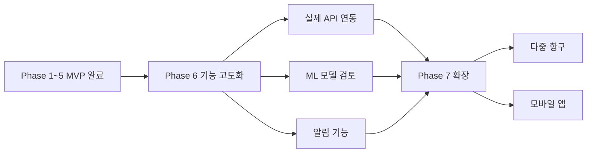

# 🗺️ 개발 로드맵

인천항 반입 cut-off 리스크 레이더 MVP는 **분산된 운영 데이터를 하나의 배차 의사결정 신호로 연결하는 것**을 목표로 단계적으로 확장됩니다. 아래 로드맵은 현재 완료된 MVP 범위와 이후 고도화 방향을 함께 정리한 것입니다.

## MVP 완료 현황

| 단계 | 내용 | 상태 |
|------|------|------|
| Phase 1 | 데이터 소스 조사 + PoC | ✅ 완료 |
| Phase 2 | 데이터 파이프라인 구축 | ✅ 완료 |
| Phase 3 | 리스크 엔진 v1 | ✅ 완료 |
| Phase 4 | 프론트엔드 MVP | ✅ 완료 |
| Phase 5 | 문서화 + 데모 + 배포 | ✅ 완료 |

## MVP 기능 체크리스트

- [x] 4개 데이터 소스 기반 입력 신호 설계
- [x] 규칙 기반 리스크 엔진 구현
- [x] 프론트엔드 입력/결과 UI 완성
- [x] 출발 시각 what-if 시뮬레이션 제공
- [x] 46개 테스트 전부 통과
- [x] GitHub Pages 데모 배포
- [x] MkDocs 문서 사이트 구성

## MVP가 의미하는 것

MVP는 단순한 혼잡 현황판이 아니라, **"지금 배차해도 cut-off를 맞출 수 있는가"**라는 운영 질문에 답하도록 설계되었습니다. 즉, 데이터 수집 → 위험 점수화 → 최적 출발 시각 제안 → 원인 설명까지 하나의 흐름으로 연결하는 것이 핵심 성과입니다.

## Phase 6: 기능 고도화

| 항목 | 목표 | 기대 효과 |
|------|------|-----------|
| 실제 API 연동 | mock 데이터 대신 실시간 교통/항만 API를 안정적으로 연결 | 데모를 넘어 현업 의사결정 정확도 향상 |
| ML 모델 도입 | 규칙 기반 v1 이후 예측 정확도 보정을 위한 학습형 모델 검토 | 시간대/패턴별 오차 감소 |
| 알림 기능 | cut-off 임박, 고위험 배차 건, 데이터 갱신 실패를 알림으로 전달 | 운영자의 선제 대응 속도 향상 |

!!! info "Phase 6의 초점"
    이 단계의 목표는 기능 개수 확대가 아니라 **정확도와 운영 활용도 강화**입니다. 특히 실제 API 품질, 데이터 지연, 결측 처리 전략이 제품 신뢰도를 좌우합니다.

## Phase 7: 확장

| 확장 축 | 설명 | 필요한 선행 조건 |
|--------|------|------------------|
| 다중 항구 지원 | 인천항 외 타 항만까지 동일한 리스크 평가 프레임 적용 | 항만별 데이터 스키마 표준화, 규칙 파라미터 분리 |
| 모바일 앱 | 현장 배차 담당자가 이동 중에도 즉시 확인 가능하도록 모바일 경험 제공 | 인증 체계, 알림 인프라, 모바일 UX 설계 |

## 기술 부채

| 영역 | 현재 상태 | 우선순위 | 메모 |
|------|-----------|----------|------|
| 프론트엔드 테스트 | 핵심 UI는 구현되었지만 자동화 테스트가 부족 | 높음 | 컴포넌트/상태 흐름 회귀 방지 필요 |
| E2E 테스트 | 전체 사용자 플로우 자동화 부재 | 높음 | 입력 → 결과 → 시뮬레이션까지 브라우저 검증 필요 |
| 로깅 | MVP 수준의 기본 로깅 중심 | 중간 | 장애 분석, 외부 API 오류 추적 개선 필요 |
| 관측성 | 메트릭/트레이싱 대시보드 미구축 | 중간 | 운영 전환 시 필수 |
| 설정 관리 | 환경별 설정 네이밍과 문서 표현 간 차이 존재 | 중간 | 운영/로컬/데모 설정 체계 정리 필요 |

## 다음 단계 우선순위 제안

1. **실제 API 연동 안정화** — 데이터 신뢰도를 높여 MVP를 실사용 가능한 수준으로 끌어올림
2. **프론트엔드/E2E 테스트 보강** — 데모와 릴리스의 회귀 위험 축소
3. **알림 및 운영 로그 강화** — 의사결정 도구를 운영 도구로 확장
4. **항만 다중화 준비** — 스키마/룰 엔진을 항구별로 일반화

