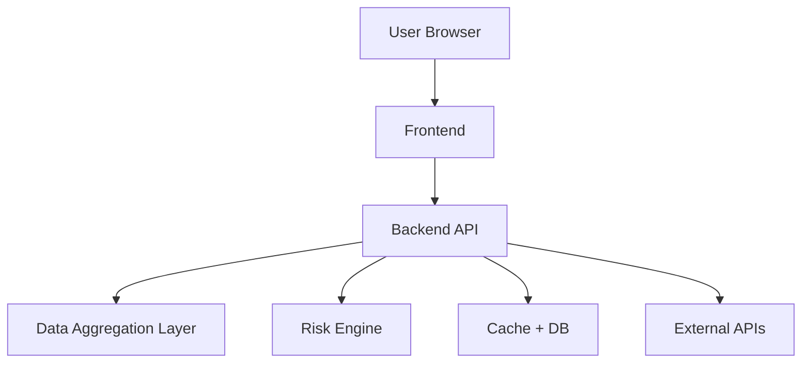

# 🏗️ 시스템 아키텍처
## 🚢 인천항 반입 Cut-off 리스크 레이더

## 1. 🧭 상위 수준 아키텍처

!!! info "아키텍처 핵심"
    Frontend는 입력과 결과 표현에 집중하고, Backend API는 데이터 집계·정규화·위험 평가를 오케스트레이션하는 중심 계층으로 동작합니다.

## 2. 🧩 구성요소

### 2.1 Frontend

책임:

- 사용자 입력 수집
- 결과 카드 렌더링
- 시뮬레이션 화면 표시
- 사유 분해 결과 표시

기술 스택:

- React 19, TypeScript, Vite
- Tailwind CSS v4
- Recharts

### 2.2 Backend API

책임:

- 작업 입력 수신
- 데이터 조회 흐름 오케스트레이션
- 원천 payload 정규화
- Risk Engine 호출
- 구조화된 응답 반환

기술 스택:

- Python 3.10+
- FastAPI
- Pydantic v2

### 2.3 Data Aggregation Layer

책임:

- 공공 API 데이터 수집
- 원천 payload를 공통 스키마로 매핑
- fallback 로직 적용
- 데이터 최신성 정보 부여

### 2.4 Risk Engine

책임:

- 총 소요 시간 추정
- 위험 점수 계산
- 확률 구간 계산
- 가장 늦어도 안전한 배차 시각 계산
- 사유 기여도 계산

### 2.5 Storage

#### Cache

- Redis 7
- 외부 API 데이터에 대한 짧은 TTL 적용

#### 영속 DB

- PostgreSQL 16
- 시나리오 로그 저장
- 정규화된 snapshot 저장
- 시뮬레이션 이력 저장

!!! tip "설계 방향"
    멘토링 프로젝트에서는 각 계층의 역할을 명확히 분리해 두면, 프론트엔드·백엔드·데이터 처리 파트를 팀원별로 병렬 개발하기 쉽습니다.

## 3. 🔄 요청 흐름

1. 사용자가 입력을 제출합니다.
2. 백엔드가 입력값을 검증합니다.
3. 데이터 계층이 캐시를 조회합니다.
4. 캐시에 없으면 원천 API에서 데이터를 가져옵니다.
5. payload를 정규화합니다.
6. Risk Engine이 작업을 평가합니다.
7. 백엔드가 요청/결과 로그를 저장합니다.
8. Frontend가 결과를 렌더링합니다.

## 4. 🛡️ 장애 처리

- 하나의 원천이 실패하면, 가능할 경우 캐시를 사용합니다.
- 중요도가 낮은 원천이 없으면 신뢰도를 낮춘 상태로 계속 진행합니다.
- 중요 원천이 실패하면 warning과 함께 부분 결과를 반환합니다.

!!! warning "운영 리스크"
    공공 API의 응답 지연이나 포맷 변경이 발생하면 집계 계층과 Risk Engine 전체의 품질에 영향을 줄 수 있으므로, 정규화와 fallback 설계가 매우 중요합니다.

!!! danger "핵심 과제"
    이 아키텍처의 핵심 과제는 다양한 원천 데이터의 불확실성을 흡수하면서도, 사용자에게는 **빠르고 이해 가능한 단일 판단 결과**를 제공하는 것입니다.
