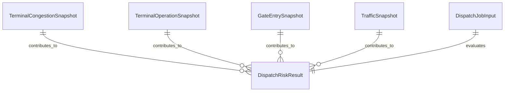

# 데이터 명세서
## 인천항 반입 Cut-off 리스크 레이더

## 1. 핵심 원천 데이터 그룹

### 1.1 터미널 혼잡 데이터

목적: 터미널 대기 압력을 추정합니다.

### 1.2 터미널 운영 정보

목적: 터미널 측 반입 운영 힌트를 반영합니다.

### 1.3 차량 진입 통계

목적: gate 측 교통 압력을 추정합니다.

### 1.4 도로 교통 데이터

목적: 출발지에서 터미널까지의 이동 시간을 추정합니다.

!!! info "데이터 설계 원칙"
    서로 다른 출처의 데이터를 그대로 노출하기보다, 내부 정규화 모델로 변환해 일관된 계산과 설명이 가능하도록 설계합니다.

## 2. 내부 정규화 모델

### TerminalCongestionSnapshot

| 필드 | 타입 |
|------|------|
| terminal_code | string |
| terminal_name | string |
| congestion_status | string |
| congestion_time_minutes | number \| null |
| observed_at | datetime |
| source_name | string |

### TerminalOperationSnapshot

| 필드 | 타입 |
|------|------|
| terminal_code | string |
| terminal_name | string |
| available_time | datetime \| null |
| expected_arrival_applied | boolean \| null |
| raw_status_note | string \| null |
| observed_at | datetime |
| source_name | string |

### GateEntrySnapshot

| 필드 | 타입 |
|------|------|
| terminal_name | string |
| lane_code | string \| null |
| entry_type | string \| null |
| vehicle_count | integer \| null |
| observed_at | datetime |
| source_name | string |

### TrafficSnapshot

| 필드 | 타입 |
|------|------|
| route_key | string |
| average_speed_kph | number \| null |
| congestion_level | string \| null |
| estimated_travel_minutes | number \| null |
| observed_at | datetime |
| source_name | string |

## 3. 사용자 입력 모델

### DispatchJobInput

| 필드 | 타입 |
|------|------|
| origin_text | string |
| terminal_code | string |
| cut_off_at | datetime |
| conservative_mode | boolean |
| manual_buffer_minutes | integer \| null |

## 4. 결과 모델

### DispatchRiskResult

| 필드 | 타입 |
|------|------|
| risk_score | integer |
| risk_level | string |
| on_time_probability | number |
| latest_safe_dispatch_at | datetime |
| estimated_total_minutes | integer |
| reason_items | list[ReasonItem] |
| data_freshness | list[SourceFreshness] |

### ReasonItem

| 필드 | 타입 |
|------|------|
| code | string |
| label | string |
| contribution_percent | integer |
| summary | string |

### SourceFreshness

| 필드 | 타입 |
|------|------|
| source_name | string |
| observed_at | datetime \| null |
| status | string |

!!! tip "구현 팁"
    데이터 모델 이름은 English 기술명을 유지하되, 설명과 표 머리글은 한국어로 통일하면 문서 가독성과 개발 편의성을 함께 확보할 수 있습니다.

!!! warning "데이터 품질 주의"
    observed_at이 오래되었거나 일부 snapshot이 누락된 경우, 계산 결과는 반환되더라도 신뢰도는 낮아질 수 있습니다.

!!! danger "핵심 과제"
    핵심 과제는 서로 다른 시간 축과 품질 수준을 가진 snapshot들을 하나의 DispatchRiskResult로 정합성 있게 결합하는 것입니다.
