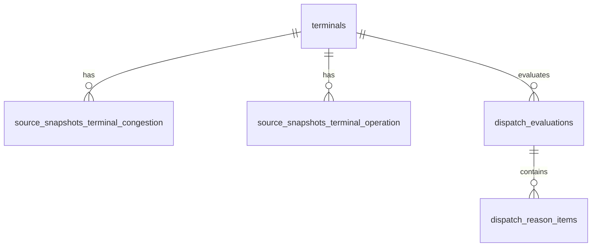

# 데이터베이스 스키마
## 인천항 반입 Cut-off 리스크 레이더

## 1. 테이블

### 1.1 terminals

| 컬럼 | 타입 |
|------|------|
| id | serial PK |
| terminal_code | varchar |
| terminal_name | varchar |
| is_active | boolean |
| created_at | timestamp |
| updated_at | timestamp |

### 1.2 source_snapshots_terminal_congestion

| 컬럼 | 타입 |
|------|------|
| id | serial PK |
| terminal_code | varchar |
| congestion_status | varchar |
| congestion_time_minutes | float |
| observed_at | timestamp |
| fetched_at | timestamp |
| raw_payload_json | jsonb |

### 1.3 source_snapshots_terminal_operation

| 컬럼 | 타입 |
|------|------|
| id | serial PK |
| terminal_code | varchar |
| available_time | timestamp |
| expected_arrival_applied | boolean |
| raw_status_note | text |
| observed_at | timestamp |
| fetched_at | timestamp |
| raw_payload_json | jsonb |

### 1.4 source_snapshots_gate_entry

| 컬럼 | 타입 |
|------|------|
| id | serial PK |
| terminal_name | varchar |
| lane_code | varchar |
| entry_type | varchar |
| vehicle_count | integer |
| observed_at | timestamp |
| fetched_at | timestamp |
| raw_payload_json | jsonb |

### 1.5 source_snapshots_traffic

| 컬럼 | 타입 |
|------|------|
| id | serial PK |
| route_key | varchar |
| average_speed_kph | float |
| estimated_travel_minutes | float |
| observed_at | timestamp |
| fetched_at | timestamp |
| raw_payload_json | jsonb |

### 1.6 dispatch_evaluations

| 컬럼 | 타입 |
|------|------|
| id | serial PK |
| origin_text | varchar |
| terminal_code | varchar |
| cut_off_at | timestamp |
| conservative_mode | boolean |
| manual_buffer_minutes | integer |
| risk_score | integer |
| risk_level | varchar |
| on_time_probability | float |
| latest_safe_dispatch_at | timestamp |
| estimated_total_minutes | integer |
| created_at | timestamp |

### 1.7 dispatch_reason_items

| 컬럼 | 타입 |
|------|------|
| id | serial PK |
| dispatch_evaluation_id | integer FK |
| code | varchar |
| label | varchar |
| contribution_percent | integer |
| summary | text |

## 2. 캐시 키 (Redis)

| 키 패턴 | 목적 |
|----------|------|
| `source:terminal_congestion:{terminal_code}` | 터미널 혼잡 snapshot |
| `source:terminal_operation:{terminal_code}` | 터미널 운영 snapshot |
| `source:gate_entry:{terminal_name}` | Gate 진입 snapshot |
| `source:traffic:{route_key}` | 교통 snapshot |

!!! info "스키마 설계 의도"
    원천 snapshot 테이블은 수집 시점의 상태를 보존하고, `dispatch_evaluations`는 실제 의사결정 결과를 저장해 추후 분석과 데모 재현에 활용할 수 있게 합니다.

!!! tip "확장 포인트"
    이후 버전에서는 source_snapshots_gate_entry와 terminals 사이의 정규화 키를 강화하면, 터미널 단위 분석 정합성을 더 높일 수 있습니다.

!!! warning "모델링 주의"
    `terminal_code`와 `terminal_name`이 혼용되면 조인 일관성이 깨질 수 있으므로, 애플리케이션 계층에서 정규화 규칙을 명확히 유지해야 합니다.

!!! danger "핵심 과제"
    핵심 과제는 원천 데이터 보존, 빠른 조회, 결과 추적 가능성을 동시에 만족하는 스키마를 설계하는 것입니다.
