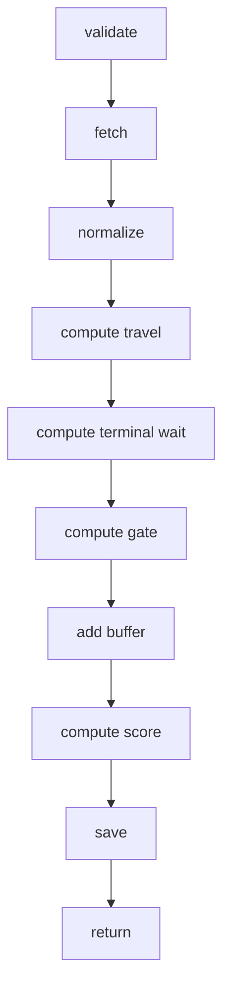

# 백엔드 명세
## 인천항 반입 컨테이너 cut-off 리스크 레이더

## 🧩 1. 모듈 구성

### app/api

- 요청 라우팅
- 유효성 검증
- 응답 형태 구성

### app/services

- 오케스트레이션 계층
- 시나리오 평가 흐름

### app/clients

- 외부 API 클라이언트
- 소스별 어댑터

### app/normalizers

- 소스 payload를 내부 스키마로 변환

### app/engine

- 리스크 계산 엔진
- 추천 엔진
- 원인 기여도 분석 엔진

### app/repositories

- 데이터베이스 접근
- 캐시 접근

### app/models

- Pydantic 스키마
- ORM 모델

## 🔄 2. 핵심 서비스 흐름

### evaluate_dispatch_job()

1. 요청을 검증한다
2. 소스 데이터를 조회한다
3. payload를 정규화한다
4. 이동 시간 추정치를 계산한다
5. 터미널 대기 시간 추정치를 계산한다
6. 게이트 조정값을 계산한다
7. 안전 버퍼를 추가한다
8. 점수 / 확률 / 추천 결과를 계산한다
9. 로그를 저장한다
10. 결과를 반환한다

## 📐 3. 엔지니어링 원칙

- MVP 단계에서는 엔진을 deterministic하게 유지한다
- 모든 소스의 최신성 timestamp를 기록한다
- 각 외부 소스는 client adapter 뒤로 격리한다
- 계산 로직은 pure function으로 테스트 가능하게 유지한다

## 🛠️ 4. 기술 스택

- Python 3.10+
- FastAPI
- Pydantic v2
- SQLAlchemy (async)
- Redis (aioredis)
- httpx (async HTTP client)
