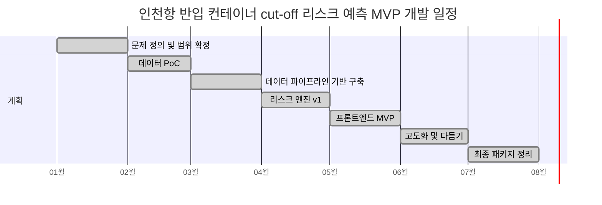

# 7개월 개발 계획
## 인천항 반입 컨테이너 cut-off 리스크 레이더

## 📅 전체 일정 개요

## 🔎 1개월 차: 문제 탐색 및 범위 확정

- [x] 문제 정의를 최종 확정한다
- [x] 공개 데이터 소스의 활용 가능성을 검증한다
- [x] MVP 범위를 정의한다
- [x] 기존 서비스와 공공 수상작 아카이브를 검토한다

**산출물:** 범위 정의 문서, 데이터 소스 인벤토리, 아키텍처 초안

## 🧪 2개월 차: 데이터 PoC

- [x] API client를 구축한다
- [x] payload 형태를 검증한다
- [x] 정규화 규칙을 작성한다
- [x] 샘플 평가 시나리오를 만든다

**산출물:** API PoC, 정규화된 소스 예시, 초기 리스크 공식 프로토타입

## 🏗️ 3개월 차: 데이터 파이프라인 기반 구축

- [x] fetch/cache/store 패턴을 구현한다
- [x] DB 스키마를 정의한다
- [x] 스냅샷 로깅을 구현한다
- [x] 실패 처리 로직을 추가한다

**산출물:** 동작하는 데이터 계층, 영속성 계층, 캐시 전략

## ⚙️ 4개월 차: 리스크 엔진 v1

- [x] deterministic 점수화 모델을 구현한다
- [x] 확률 매핑 로직을 구현한다
- [x] 최신 안전 배차 시각 계산 로직을 구현한다
- [x] 원인 기여도 분석 로직을 구현한다

**산출물:** 엔진 v1, 단위 테스트, 시나리오 fixture

## 🖥️ 5개월 차: 프론트엔드 MVP

- [x] 입력 페이지를 구현한다
- [x] 결과 페이지를 구현한다
- [x] 원인 분석 섹션을 구현한다
- [x] 시뮬레이션 섹션을 구현한다

**산출물:** MVP 웹앱, 데모 가능한 UI

## 🎯 6개월 차: 고도화

- [x] 점수 가중치를 조정한다
- [x] 문구 표현을 개선한다
- [x] degraded-data 처리 방식을 개선한다
- [x] 데모 시나리오를 검증한다

**산출물:** 엔진 v2, 개선된 UX, 데모 스크립트

## 📦 7개월 차: 최종 패키지

- [x] 최종 보고서를 정리한다
- [x] 발표 자료를 제작한다
- [x] 데모 영상 흐름을 정리한다
- [x] 다음 단계 로드맵을 수립한다

**산출물:** 최종 문서, 피치 패키지, 릴리스 후보본
